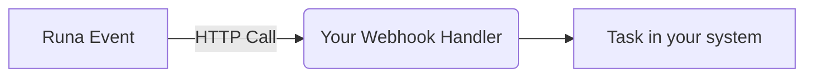

## Introduction

When using API endpoints you only get data back when you make a call. This is great for when you want to know the current state of something now, but it's not ideal for when you want to know when something changes in the future.

Webhooks are a way to receive real-time updates from Runa whenever something changes the moment it happens.

## Receiving webhooks



At their core webhooks are just a `POST` request to a URL you provide; a bit like a reverse API call. Normally you would provision an endpoint specifically for receiving Runa webhooks.

Your endpoint should return a `200` status code to indicate that the webhook was received and processed successfully.

As your webhook endpoint will be accessible from the internet, you should verify that each request is coming from Runa.

## Webhook events

We currently support the following webhook events:

<Columns cols={2}>
  <Card
    title="Order completion"
    icon="flag-checkered"
    href="/reference/2024-02-05/webhook/order.completion"
    arrow
  >
    The `order.completion` webhook is triggered when an order has finished
    processing.
  </Card>
  <Card
    title="Product update"
    icon="money-check-pen"
    href="/reference/2024-02-05/webhook/product.update"
    arrow
  >
    The `product.update` webhook is triggered when a product in the catalogue is
    updated.
  </Card>
</Columns>

## Adding an endpoint

<Steps>
    <Step title="Enter the webhook portal">
        From the [API section](https://app.runa.io/api-keys) in your Runa account, click *View webhook*. This will open your webhook portal, powered by Svix.
        <Frame caption="Click the 'View webhook' button to open your webhook portal">
            
        </Frame>
    </Step>
    <Step title="Add an endpoint">
        Once in the webhook portal, click *Add new endpoint*. This will open a form where you can enter the URL of your endpoint. You can optionally add a description.

        <Frame caption="Click the 'Add new endpoint' button to open the form">
            
        </Frame>

        Select a single event type to receive. If you need to receive multiple event types, you can add multiple endpoints.

        <Note>
            If you don't have a URL or your service isn't quite ready to start receiving events just yet, just press the use Svix Play button to have a unique testing URL generated for you.

            You'll be able to view and inspect events sent to your Play URL.
        </Note>
    </Step>

</Steps>

## Testing your endpoint

<Info>
  Webhooks are currently unsupported in the [playground
  environment](/reference/2024-02-05/playground). You should use the test
  function in the webhook portal instead.
</Info>

You can send simulated events to your endpoint to verify your handler is working as expected. In the webhook portal select the endpoint you want to test and select the **Testing** tab.

<Frame caption="Choose the event type you want to test and click the 'Send Example' button">
  
</Frame>

Choose the event type you want to test and click the **Send Example** button. After the event is sent you will see a record in the _Message Attempts_ table. Click into the record to see details.

<Frame caption="Webhook deliveries are shown in the message attempts table">
  
</Frame>

## Securing your endpoint

As your endpoint for receiving webhooks will be accessible from the internet, you should secure it to ensure only events from Runa are accepted.

### Signature verification

Every event we send is signed with a signature. You can verify the signature by checking the `svix-signature` header in the request. Our webhook partner Svix offers a set of useful libraries that make verifying webhooks very simple. Here is an example using Javascript:

```javascript Signature verification example [expandable]
import { Webhook } from "svix";

const secret = "whsec_MfKQ9r8GKYqrTwjUPD8ILPZIo2LaLaSw";

// These were all sent from the server
const headers = {
  "svix-id": "msg_p5jXN8AQM9LWM0D4loKWxJek",
  "svix-timestamp": "1614265330",
  "svix-signature": "v1,g0hM9SsE+OTPJTGt/tmIKtSyZlE3uFJELVlNIOLJ1OE=",
};
const payload = '{"test": 2432232314}';

const wh = new Webhook(secret);
// Throws on error, returns the verified content on success
const payload = wh.verify(payload, headers);
```

For more information, including support for other languages, see the [webhook verification documentation on Svix's website](https://docs.svix.com/receiving/verifying-payloads/how).

### IP allowlisting

In case your webhook receiving endpoint is behind a firewall or NAT, you may need to allow traffic from Svix's IP addresses.

This is the full list of IP addresses that webhooks may originate from:

```
52.215.16.239
54.216.8.72
63.33.109.123
```

## Failure handling

If we are unable to deliver a webhook to your endpoint, we will retry several times before giving up. If all attempts to a specific endpoint fail for a period of 5 days, the endpoint will be disabled.

### Retrying failed deliveries

Svix attempts to deliver each webhook message based on a retry schedule with exponential backoff. Each message is attempted based on the following schedule, where each period is started following the failure of the preceding attempt:

- Immediately
- 5 seconds
- 5 minutes
- 30 minutes
- 2 hours
- 5 hours
- 10 hours
- 10 hours (in addition to the previous)

For example, an attempt that fails four times before eventually succeeding will be delivered roughly 35 minutes and 5 seconds following the first attempt.

### Manual retries

You can also use the application portal to manually retry each message at any time, or automatically retry all failed messages starting from a given date.

### Failure recovery

If all attempts to a specific endpoint fail for a period of 5 days, the endpoint will be disabled. To re-enable a disabled endpoint, go to the webhook dashboard, find the endpoint from the list and select "Enable Endpoint".

### Recovering/Resending failed messages

If your service has had downtime or was misconfigured you may have missed some messages. You can resend specific messages or resend all failed messages starting from a given date.

#### Resending a single message

If you want to replay a single event, you can find the message from the UI and click the options menu next to any of the attempts.

<Frame caption="You can resend a single message by clicking the options menu next to any of the attempts">
  
</Frame>

From there, click "resend" to have the same message send to your endpoint again.

#### Resending all failed messages

If you need to recover from a service outage and want to replay all the failed messages since a given time, you can do so from the Endpoint page. On an endpoint's details page, click **Options > Recover Failed Messages**.

<Columns cols={2}>
  <Frame caption="Click the 'Recover Failed Messages' button to resend all failed messages">
    
  </Frame>

  <Frame caption="Select the time range you want to recover from and click the 'Recover' button">
    
  </Frame>
</Columns>

## Troubleshooting

There are some common reasons why your webhook endpoint is not working as expected.

### Not using the raw payload body when verifying the signature

This is the most common issue. When generating the signed content, we use the raw string body of the message payload.

If you convert JSON payloads into strings using methods like stringify, different implementations may produce different string representations of the JSON object, which can lead to discrepancies when verifying the signature. It's crucial to verify the payload exactly as it was sent, byte-for-byte or string-for-string, to ensure accurate verification.

### Sending a non `2xx` response

When we receive a response with a 2xx status code, we interpret that as a successful delivery even if you indicate a failure in the response payload. Make sure to use the right response status codes so we know when message are supposed to succeed vs fail.

### Responses timing out

If a message delivery attempt takes longer than 15 seconds to get a `2xx` response, we will consider it a failed delivery.

If your endpoint needs to complete complex work we suggest you simply receive the message and add it to a queue to be processed asynchronously.
